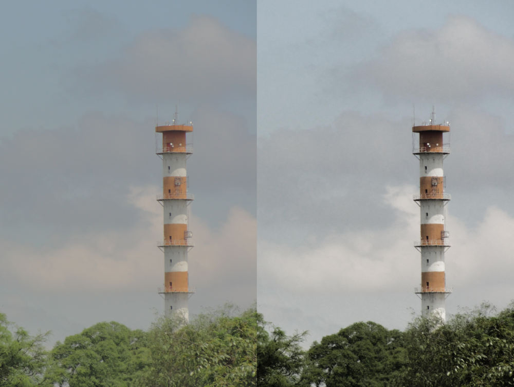
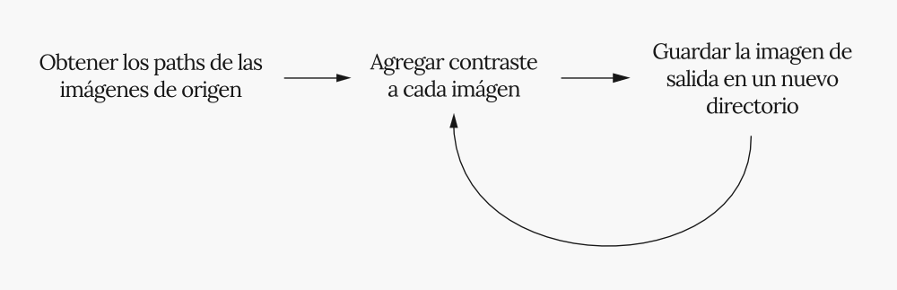

¿Cómo agregar contraste a un grupo de imágenes automáticamente con [image-contrast](https://github.com/MatiPruvost/image-contrast)?

Hace un tiempo tuve la necesidad de aplicar contraste a un grupo de imágenes,
cerca de 100 fotografías. Podía prescindir de un contraste especifico
para cada fotografía en particular, por lo tanto, un nivel constante a cada
imagen ya era suficiente.

Para manipular fotografías acostumbro a utilizar [Gimp](https://www.gimp.org/),
sin embargo, para este caso, era mejor:

- Correr un script que aplique un contraste a cada imagen automáticamente.
- Las imágenes de origen estén alojadas en un directorio.
- Las imágenes con contraste queden en otro directorio.

Con esa idea simple comencé a agregar lineas de código al script, y como esquema
simplificado tenía la siguiente propuesta:

Después de unas horas surgió
[image-contrast](https://github.com/MatiPruvost/image-contrast) que permite
modificar el contraste de una serie de imágenes automáticamente con una sola
línea de comando.

A continuación dejo una guía para trabajar con image-contrast.

# Instalar requisitos
- [Git](https://git-scm.com/book/en/v2/Getting-Started-Installing-Git)
- [Node](https://nodejs.org/en/download/)

# Instalación
Clonar el repositorio:
- `$ git clone git@github.com:MatiPruvost/image-contrast.git`

Instalar dependencias:
- `$ npm install`

# Ejecutar image-contrast
- `$ node index.js -i "directorio de entrada" -o "Directorio de salida" -c "Valor de contraste"`

# Colaborar con el proyecto
Si tenes un tiempo disponible y te gustaría mejorar algo del proyecto estás
invitado a participar e incluir tus propuestas.

En este [link](https://gist.github.com/Chaser324/ce0505fbed06b947d962) vas a
encontrar algunas ideas de como colaborar en GitHub.
